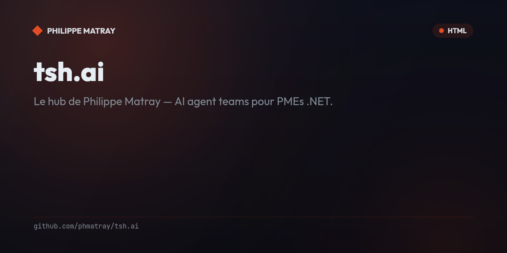

# tsh.ai ☕

<!-- portfolio-badges:start -->
<!-- Identity -->
[](https://github.com/phmatray/tsh.ai)

[](https://github.com/phmatray/tsh.ai/stargazers)
[](https://github.com/phmatray/tsh.ai/network/members)
[](https://github.com/phmatray/tsh.ai/blob/HEAD/LICENSE)

<!-- Activity -->
[](https://github.com/phmatray/tsh.ai/issues)
[](https://github.com/phmatray/tsh.ai/pulls)
[](https://github.com/phmatray/tsh.ai/commits)
<!-- portfolio-badges:end -->

<!-- portfolio-toc:start -->

## Table of Contents

- [What's inside](#whats-inside)
- [Newsletter](#newsletter)
- [Stack](#stack)
- [Run locally](#run-locally)
- [Deploy (k8s)](#deploy-k8s)
- [Projects featured](#projects-featured)
- [DNS (for Philippe)](#dns-for-philippe)
- [Contributing](#contributing)

<!-- portfolio-toc:end -->

<!-- portfolio-getstarted:start -->

## Getting Started

### Prerequisites

- [.NET SDK](https://dotnet.microsoft.com/download)

### Run

```bash
git clone https://github.com/phmatray/tsh.ai.git
cd tsh.ai
dotnet restore
dotnet build
dotnet run --project TshAi/TshAi.csproj
```

<!-- portfolio-getstarted:end -->


> **Le hub de Philippe Matray** — AI agent teams pour PMEs .NET.

Personal brand hub + newsletter landing page for [Philippe Matray](https://github.com/phmatray).

**Live:** [tsh.garry-ai.cloud](https://tsh.garry-ai.cloud) *(temp domain — final: tsh.ai)*

---

## What's inside

| Page | Description |
|------|-------------|
| `/` | Landing page — hero, newsletter signup, projects, about |
| `/newsletter` | Archive of *Le Chai du Dev* issues |
| `/projets` | OSS projects list |

## Newsletter

**Le Chai du Dev** — weekly insights on .NET + AI agents + Atypical Consulting.

Subscribe at [tsh.garry-ai.cloud](https://tsh.garry-ai.cloud) ↗

## Stack

- **Blazor Server** (.NET 10)
- **CSS custom** — no heavy framework
- **Design:** warm amber + cream + soft violet
- **Docker** + **k3s** (Traefik ingress, cert-manager TLS)

## Run locally

```bash
cd TshAi
dotnet run
# → http://localhost:5000
```

## Deploy (k8s)

```bash
# Apply all manifests
kubectl apply -f k8s/

# Rollout
kubectl rollout restart deployment/tsh-ai -n tsh
```

## Projects featured

| Project | Description |
|---------|-------------|
| [TaLibStandard](https://github.com/phmatray/TaLibStandard) | TA-Lib for .NET — technical analysis indicators |
| [FormCraft](https://github.com/phmatray/FormCraft) | Fluent Blazor form builder |
| [TenantKit](https://github.com/phmatray/TenantKit) | Multi-tenancy toolkit for ASP.NET Core |
| [NuGetPulse](https://github.com/phmatray/NuGetPulse) | NuGet package monitoring dashboard |

## DNS (for Philippe)

Point `tsh.ai` → `72.61.194.21` at your registrar to go live on the real domain.

---

MIT License · Made with ☕ by [Ritchie](https://github.com/phmatray) for Philippe Matray

---

<!-- portfolio-roadmap:start -->

## Roadmap

Planned work and known limitations are tracked in the [open issues](https://github.com/phmatray/tsh.ai/issues). Contributions toward them are welcome.

<!-- portfolio-roadmap:end -->

<!-- portfolio-sections:start -->

## Contributing

Contributions are welcome. Open an issue first to discuss any significant change.

1. Fork the repository and create your branch (`git checkout -b feat/my-feature`)
2. Commit your changes (`git commit -m 'feat: ...'`)
3. Push the branch and open a Pull Request

<!-- portfolio-sections:end -->
